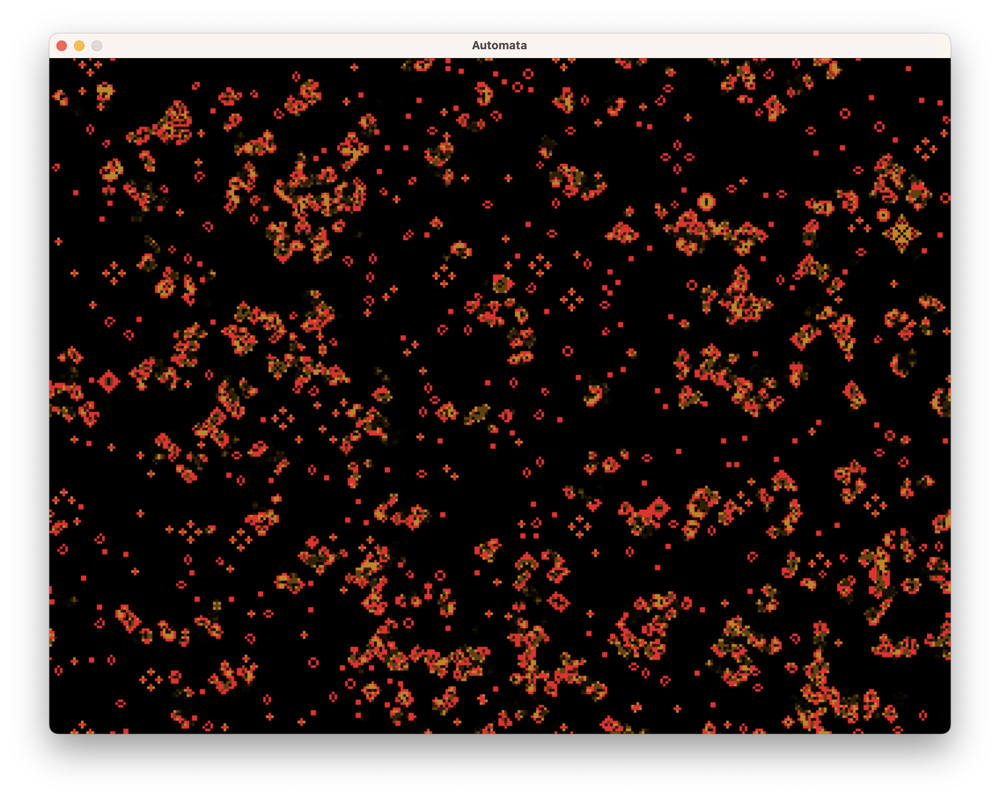

# Automata

**Automata simulator written in C++ and SDL2**

Currently only one experimental implementation of a Game Of Life clone is implemented.



## Prerequisites

### macOS

```
brew install sdl2
```


## Build

```
cmake -DCMAKE_BUILD_TYPE=Release .
cmake --build .
```


# Nutzungshinweise

Diese Software wurde zu Lehr- und Demonstrationszwecken geschaffen und ist nicht für den produktiven Einsatz vorgesehen. Heise Medien und der Autor haften daher nicht für Schäden, die aus der Nutzung der Software entstehen, und übernehmen keine Gewähr für ihre Vollständigkeit, Fehlerfreiheit und Eignung für einen bestimmten Zweck.

